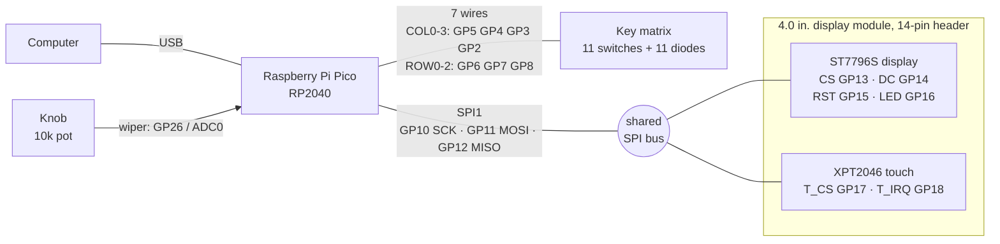
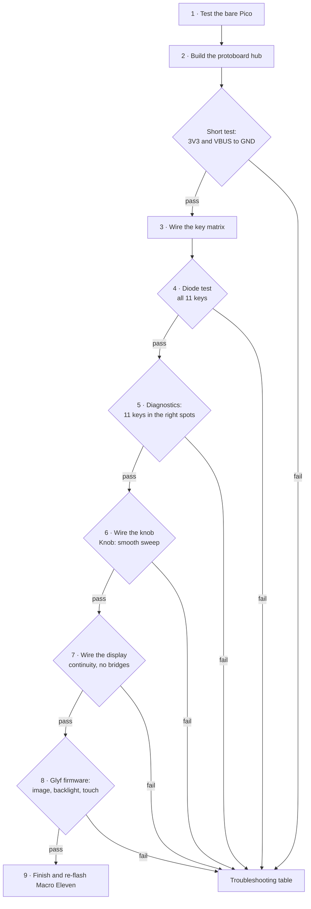
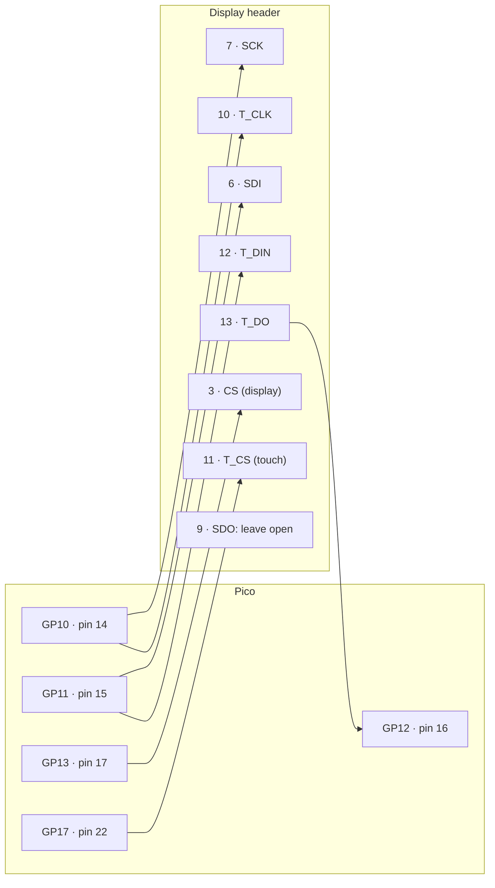

# Macro Eleven rev 2: hand-wiring guide

Step-by-step guide to hand-wire a Raspberry Pi Pico, the 11-key matrix, the knob, and the 4.0" touch display on a protoboard. There is no PCB. Each stage ends with a test, so a fault shows up at the stage that caused it.

**This guide assumes this hardware:**

| Part | Detail |
|------|--------|
| MCU | Raspberry Pi Pico or Pico H (**RP2040**). A Pico 2 (RP2350) does not run this firmware. |
| Keys | 11 switches in the Macro Eleven layout (3 rows x 4 columns, knob in the top-right slot) |
| Knob | 10 kΩ linear potentiometer (B10K) |
| Display | 4.0" ST7796S SPI TFT, 480x320, XPT2046 resistive touch, 14-pin header (same panel as the [Glyf display module](../../../../glyf/display/docs/glyf.md)) |

> **Firmware status.** No single rev 2 firmware exists yet (audit task SCR-09). This guide tests the board with the two firmwares that exist today:
> - **Macro Eleven (QMK)** tests the keys and the knob.
> - **Glyf display (Pico SDK)** tests the screen and touch.
>
> The pin plan below keeps the keys on the rev 1 pins and the display on the Glyf display pins. Both firmwares run on this board without changes.

> **Mermaid diagrams.** GitHub renders the `mermaid` blocks. In VS Code, install the *Markdown Preview Mermaid Support* extension. All wiring facts are also in the tables and text diagrams.

---

## Contents

1. [What you are building](#what-you-are-building)
2. [Pin plan](#pin-plan)
3. [Parts and tools](#parts-and-tools)
4. [Build order](#build-order)
5. [Step 1: Test the bare Pico](#step-1-test-the-bare-pico)
6. [Step 2: Build the protoboard hub](#step-2-build-the-protoboard-hub)
7. [Step 3: Wire the key matrix](#step-3-wire-the-key-matrix)
8. [Step 4: Test the matrix with a multimeter](#step-4-test-the-matrix-with-a-multimeter)
9. [Step 5: Connect the matrix and test the keys](#step-5-connect-the-matrix-and-test-the-keys)
10. [Step 6: Wire and test the knob](#step-6-wire-and-test-the-knob)
11. [Step 7: Wire the display](#step-7-wire-the-display)
12. [Step 8: Test the display and touch](#step-8-test-the-display-and-touch)
13. [Step 9: Finish](#step-9-finish)
14. [Troubleshooting](#troubleshooting)
15. [Firmware follow-ups](#firmware-follow-ups)

---

## What you are building



The display and the touch controller share one SPI bus (clock, data out, data in). Each one has its own chip-select line, so the Pico talks to one at a time.

---

## Pin plan

All signals are 3.3 V. **Never connect VBUS or VSYS (5 V) to a GPIO pin.**

| Function | GPIO | Pico pin | Goes to |
|----------|------|---------:|---------|
| COL0 (left column) | GP5 | 7 | J1-1 |
| COL1 | GP4 | 6 | J1-2 |
| COL2 | GP3 | 5 | J1-3 |
| COL3 (right column) | GP2 | 4 | J1-4 |
| ROW0 (top row) | GP6 | 9 | J1-5 |
| ROW1 | GP7 | 10 | J1-6 |
| ROW2 (bottom row) | GP8 | 11 | J1-7 |
| Knob wiper | GP26 / ADC0 | 31 | J3-2 |
| Knob ground | AGND | 33 | J3-1 |
| Knob + and display power | 3V3(OUT) | 36 | J3-3, display pin 1 |
| Display ground | GND | 38 | display pin 2 |
| SPI clock | GP10 | 14 | display pins 7 and 10 |
| SPI data out (MOSI) | GP11 | 15 | display pins 6 and 12 |
| SPI data in (MISO) | GP12 | 16 | display pin 13 |
| Display chip select | GP13 | 17 | display pin 3 |
| Display data/command | GP14 | 19 | display pin 5 |
| Display reset | GP15 | 20 | display pin 4 |
| Backlight (PWM) | GP16 | 21 | display pin 8 |
| Touch chip select | GP17 | 22 | display pin 11 |
| Touch interrupt | GP18 | 24 | display pin 14 |

### Pico pinout (top view, USB at the top)

Double lines (`═══`) mark the pins this build uses.

```
                            ┌─────┤ USB ├─────┐
                 GP0   1 ───┤                 ├─── 40 VBUS
                 GP1   2 ───┤                 ├─── 39 VSYS
                 GND   3 ───┤                 ╞═══ 38 GND      ── TFT GND
 COL3 (right) ── GP2   4 ═══╡                 ├─── 37 3V3_EN
         COL2 ── GP3   5 ═══╡                 ╞═══ 36 3V3(OUT) ── TFT VCC + knob +
         COL1 ── GP4   6 ═══╡                 ├─── 35 ADC_VREF
  COL0 (left) ── GP5   7 ═══╡                 ├─── 34 GP28
                 GND   8 ───┤                 ╞═══ 33 AGND     ── knob -
   ROW0 (top) ── GP6   9 ═══╡                 ├─── 32 GP27
         ROW1 ── GP7  10 ═══╡     RP2040      ╞═══ 31 GP26     ── knob wiper
ROW2 (bottom) ── GP8  11 ═══╡                 ├─── 30 RUN
                 GP9  12 ───┤                 ├─── 29 GP22
                 GND  13 ───┤                 ├─── 28 GND
  SCK + T_CLK ── GP10 14 ═══╡                 ├─── 27 GP21
  SDI + T_DIN ── GP11 15 ═══╡                 ├─── 26 GP20
         T_DO ── GP12 16 ═══╡                 ├─── 25 GP19
       TFT CS ── GP13 17 ═══╡                 ╞═══ 24 GP18     ── T_IRQ
                 GND  18 ───┤                 ├─── 23 GND
    TFT DC/RS ── GP14 19 ═══╡                 ╞═══ 22 GP17     ── T_CS
    TFT RESET ── GP15 20 ═══╡                 ╞═══ 21 GP16     ── TFT LED (PWM)
                            └───┬────┬────┬───┘
                              SWCLK GND SWDIO     (SWD pads)
```

The layout groups well: keys use pins 4 to 11 (left, top half), the display uses pins 14 to 24 (bottom of both sides), and the knob and power use pins 31 to 38 (right, top half).

### Warning: the underside is mirrored

You solder on the underside of the protoboard. From below, the Pico is mirrored left to right. **Pin 1 (GP0) is at the top right.**

```
               ┌─────┤ USB ├─────┐
    VBUS 40 ───┤                 ├─── 1  GP0
    VSYS 39 ───┤                 ├─── 2  GP1
     GND 38 ───┤                 ├─── 3  GND
         ...   │  solder side    │   ...
    GP17 22 ───┤                 ├─── 19 GP14
    GP16 21 ───┤                 ├─── 20 GP15
               └─────────────────┘
```

Before each solder joint on the Pico header, count pins from the nearest GND pin (3, 8, 13, 18 on one side; 23, 28, 33, 38 on the other). GND pins have square pads on the Pico, so they are easy to find.

---

## Parts and tools

### Parts

- [ ] Raspberry Pi Pico or Pico H (RP2040), headers soldered or loose
- [ ] 11 mechanical switches (MX or Choc) in a plate, or hot-swap sockets (see [`shared/libs/hotswap-sockets`](../../../../../shared/libs/hotswap-sockets))
- [ ] 11 x 1N4148 diodes, plus spares
- [ ] 1 x 10 kΩ linear potentiometer (B10K) and a knob cap
- [ ] 1 x 4.0" ST7796S SPI TFT with XPT2046 touch (14-pin header)
- [ ] 1 x protoboard, about 7 x 9 cm or larger
- [ ] 2 x 1x20 female headers (socket for the Pico)
- [ ] 2 x 1x20 male headers (only if your Pico has no headers)
- [ ] Header strips for the connectors: J1 (1x7), J2 (1x14), J3 (1x3)
- [ ] Solid-core wire, 26 to 28 AWG, in at least 4 colors (or 30 AWG wire-wrap wire)
- [ ] Female-to-female Dupont jumpers, 10 cm (for the display, if it does not plug straight into J2)
- [ ] Heat-shrink tube, Kapton tape, masking tape for labels
- [ ] USB data cable (a charge-only cable does not work)

### Tools

- [ ] Soldering iron with a fine tip (330 to 350 °C for leaded solder, 350 to 380 °C for lead-free)
- [ ] Solder, 0.5 to 0.8 mm, and flux
- [ ] Multimeter with continuity (beep) and diode modes
- [ ] Flush cutters, wire strippers, tweezers
- [ ] Desoldering braid or pump
- [ ] Helping hands or a PCB holder
- [ ] Safety glasses and ventilation

### Suggested wire colors

| Color | Use |
|-------|-----|
| Red | 3V3 |
| Black | GND and AGND |
| Blue | Columns |
| Bare diode legs, or white | Rows |
| Yellow | SPI clock (GP10) |
| Green | MOSI (GP11) |
| Orange | MISO (GP12) |
| Gray | Chip selects, DC, reset |
| Purple | Backlight and touch IRQ |

### Safety

- Unplug USB before you solder or change any wire.
- Wear glasses when you clip leads. Cut leads fly.
- Work with ventilation. Wash your hands after you use leaded solder.

---

## Build order



Do not skip a test. A fault is easy to find when only one stage is new.

---

## Step 1: Test the bare Pico

1. If the Pico has no headers, solder the two 1x20 male headers. Push the header pins into a breadboard first. The breadboard holds them straight while you solder.
2. Hold the **BOOTSEL** button and plug the Pico into your computer. Release the button.
3. Confirm that a drive named `RPI-RP2` appears.
4. Copy the bundled Macro Eleven firmware to the drive:

   ```bash
   cp apps/macro-eleven/src-tauri/firmware/macro_eleven.uf2 /Volumes/RPI-RP2/
   ```

5. The drive disappears and the Pico restarts as Macro Eleven.
6. Run the companion app and confirm the status shows Connected:

   ```bash
   pnpm dev:macro-eleven
   ```

**Pass:** the app connects. No keys show as pressed.
**Fail:** no `RPI-RP2` drive. Try another USB cable (many cables are charge-only).

Unplug the Pico.

---

## Step 2: Build the protoboard hub

The protoboard holds the Pico and three connectors. The keys, knob, and display plug into the connectors. You can then remove and test each part alone.

### Layout

```
                    board edge: USB cable exits here
┌─────────────────────────┬─────────────┬───────────────────────────┐
│                         │     USB     │                           │
│  J1 matrix (1x7)        │             │   J3 knob (1x3)           │
│  ┌──┬──┬──┬──┬──┬──┬──┐ │             │   ┌──┬──┬──┐              │
│  │C0│C1│C2│C3│R0│R1│R2│ │    Pico     │   │ -│ W│ +│              │
│  └──┴──┴──┴──┴──┴──┴──┘ │  in female  │   └──┴──┴──┘              │
│   wires to pins 4-11 ───┤   headers   ├─── wires to pins 31-36    │
│                         │             │                           │
│                         └─────────────┘                           │
│      wires from pins 14-24 (both sides) run down to J2            │
│                                                                   │
│  ┌──┬──┬──┬──┬──┬──┬──┬──┬──┬──┬──┬──┬──┬──┐                      │
│  │ 1│ 2│ 3│ 4│ 5│ 6│ 7│ 8│ 9│10│11│12│13│14│  J2 display (1x14)   │
│  └──┴──┴──┴──┴──┴──┴──┴──┴──┴──┴──┴──┴──┴──┘                      │
└───────────────────────────────────────────────────────────────────┘
```

### Connector pinouts

**J1: key matrix (1x7)**

| J1 pin | Signal | Pico pin | GPIO |
|-------:|--------|---------:|------|
| 1 | COL0 (left) | 7 | GP5 |
| 2 | COL1 | 6 | GP4 |
| 3 | COL2 | 5 | GP3 |
| 4 | COL3 (right) | 4 | GP2 |
| 5 | ROW0 (top) | 9 | GP6 |
| 6 | ROW1 | 10 | GP7 |
| 7 | ROW2 (bottom) | 11 | GP8 |

**J3: knob (1x3)**

| J3 pin | Signal | Pico pin |
|-------:|--------|---------:|
| 1 (-) | AGND | 33 |
| 2 (W) | GP26 / ADC0 (wiper) | 31 |
| 3 (+) | 3V3(OUT) | 36 |

**J2: display (1x14)**, see [Step 7](#step-7-wire-the-display). Pin 9 stays unconnected.

### Procedure

1. Plug the Pico's male headers into the two female headers. Set the whole stack on the protoboard, with the USB port at the board edge.
2. Solder two opposite corner pins of each female header. Check that the Pico sits flat. Then solder the other pins. The Pico keeps the headers aligned while you solder.
3. Remove the Pico. From now on, it stays out while you solder. It goes back in only for tests.
4. Solder J1, J2, and J3 in the places shown in the layout. Leave at least one empty row of holes between a connector and the Pico headers.
5. Run the wires on the underside, from each Pico header pin to its connector pin (tables above). Use the [mirrored view](#warning-the-underside-is-mirrored).
   - Leave the J2 wires for Step 7. Do J1 and J3 now.
6. Keep the SWD pads at the bottom edge of the Pico clear, so you can connect a debug probe later.
7. Optional: add a small push button from **RUN** (pin 30) to **GND** (pin 28). Hold BOOTSEL and tap the button to enter the bootloader without unplugging the cable.

### Test: no shorts

Pico **out** of the socket, multimeter in continuity mode:

| Probe A | Probe B | Expected |
|---------|---------|----------|
| Pin 36 (3V3) | Pin 38 (GND) | No beep |
| Pin 40 (VBUS) | Pin 38 (GND) | No beep |
| Each J1 pin | The J1 pin next to it | No beep |
| Each J1 pin | Its Pico header pin | Beep |
| Each J3 pin | Its Pico header pin | Beep |

A beep between 3V3 and GND means a short. Find it before you continue.

---

## Step 3: Wire the key matrix

The matrix uses 7 GPIO pins for 11 keys. Each key sits where one column wire meets one row wire. Each key has a diode, so the Pico can read several keys pressed at the same time without ghost presses.

### Matrix schematic

```
                        COL0 · GP5       COL1 · GP4       COL2 · GP3       COL3 · GP2
                        (left)                                             (right)
                        │                │                │                │
                        ├─[SW 0,0]─┐     ├─[SW 0,1]─┐     ├─[SW 0,2]─┐     │   no switch:
                        │          ▼     │          ▼     │          ▼     │   knob slot
  ROW0 · GP6 ───────────┼──────────┴─────┼──────────┴─────┼──────────┴─────┼───────────
                        │                │                │                │
                        ├─[SW 1,0]─┐     ├─[SW 1,1]─┐     ├─[SW 1,2]─┐     ├─[SW 1,3]─┐
                        │          ▼     │          ▼     │          ▼     │          ▼
  ROW1 · GP7 ───────────┼──────────┴─────┼──────────┴─────┼──────────┴─────┼──────────┴
                        │                │                │                │
                        ├─[SW 2,0]─┐     ├─[SW 2,1]─┐     ├─[SW 2,2]─┐     ├─[SW 2,3]─┐
                        │          ▼     │          ▼     │          ▼     │          ▼
  ROW2 · GP8 ───────────┼──────────┴─────┼──────────┴─────┼──────────┴─────┼──────────┴
```

- `▼` is a diode. The triangle points at the black band. **The band always faces the row.**
- At `┼`, a column crosses a row. **The two wires must not touch.**
- `[SW r,c]` is the switch at row `r`, column `c`. `[0,0]` is the top-left key (HOME in the `apps` keymap).

### Front and back view

You solder the switches from the back. From the back, the columns are mirrored.

```
  FRONT (keycap side)                  BACK (solder side, plate flipped)
  ┌──────┬──────┬──────┬──────┐        ┌──────┬──────┬──────┬──────┐
  │ 0,0  │ 0,1  │ 0,2  │ knob │        │ knob │ 0,2  │ 0,1  │ 0,0  │
  ├──────┼──────┼──────┼──────┤        ├──────┼──────┼──────┼──────┤
  │ 1,0  │ 1,1  │ 1,2  │ 1,3  │        │ 1,3  │ 1,2  │ 1,1  │ 1,0  │
  ├──────┼──────┼──────┼──────┤        ├──────┼──────┼──────┼──────┤
  │ 2,0  │ 2,1  │ 2,2  │ 2,3  │        │ 2,3  │ 2,2  │ 2,1  │ 2,0  │
  └──────┴──────┴──────┴──────┘        └──────┴──────┴──────┴──────┘
   COL0   COL1   COL2   COL3            COL3   COL2   COL1   COL0
   GP5    GP4    GP3    GP2             GP2    GP3    GP4    GP5
```

Put a strip of masking tape on the back of the plate. Write `COL0` above the rightmost column and `COL3` above the leftmost column.

### One key, close up

```
  COLUMN wire (insulated solid core;
  strip a short gap at each switch)
       │
       │         ┌─────────────┐
       ├─────────┤ pin 1       │
       │         │   switch    │  (seen from the back)
       │         │       pin 2 ├──┐
       │         └─────────────┘  │  anode leg
       │                          ▼  1N4148: triangle points at the band
       │                         ───  black band = cathode
       │                          │  cathode leg, bent along the row
 ROW ──┼──────────────────────────┴────────── on to the next key in this row
       │
       └── on to the next key in this column
```

### The diode

```
   anode leg                                  cathode leg
   to switch pin 2  ─────────[▒▒▒▒▒▒▒▒▒▒█]─────────  to ROW
                                        ▲
                                   black band (cathode)
```

### Procedure

1. Put the switches in the plate. Flip the plate so the pins face you.
2. Choose which switch pin is the **column pin** and which is the **diode pin**. Use the same choice on all 11 switches.
3. **Diodes.** For each switch:
   1. Bend the anode leg (the end without the band) into a small hook.
   2. Hook it around the diode pin and solder it. Keep the iron on the joint for 3 seconds or less. The glass body is sensitive to heat.
   3. Point the cathode leg (the band end) along the row, toward the next switch.
4. **Rows.** For each row, bend the cathode legs so each one overlaps the next. Solder each overlap. The legs now form a bare row wire.
   - Row 0 has only 3 switches. Nothing goes in the knob slot.
   - Keep each row wire at least 2 mm away from every column pin.
5. **Columns.** For each column, run one insulated wire past the column pin of each switch in that column.
   1. At each switch, strip a 3 mm gap in the insulation. Slide the insulation with the stripper to make the gap, without cutting the wire.
   2. Wrap the bare gap once around the column pin and solder it.
   3. The column wire crosses the bare row wires. The insulation keeps them apart. Check each crossing.
6. **Leads to J1.** Solder one wire to the end of each column (4 wires) and each row (3 wires). Label them `C0`, `C1`, `C2`, `C3`, `R0`, `R1`, `R2` with tape. Use the back-view table to get `C0` to `C3` right.
7. Clip all extra leads. Inspect each joint: it must be shiny and cone-shaped, and must not touch the joint next to it.

> **Hot-swap sockets:** the wiring is the same. Solder to the two socket pads instead of the switch pins.

---

## Step 4: Test the matrix with a multimeter

Test the matrix at the ends of its 7 leads (or at J1 if the leads are already connected), before you connect it to the Pico.

Set the multimeter to **diode mode**. Put the **red** probe on the column and the **black** probe on the row of the key under test.

| Condition | Expected reading |
|-----------|------------------|
| Key released | `OL` (open) |
| Key pressed | 0.5 to 0.7 V (500 to 700 mV) |
| Probes swapped, key pressed | `OL` (this proves the diode points the right way) |

Then check for shorts, with no keys pressed, in continuity mode:

| Probe A | Probe B | Expected |
|---------|---------|----------|
| Any column | Any other column | No beep |
| Any row | Any other row | No beep |
| Any column | Any row | No beep |

Tick each key as it passes:

| | COL0 | COL1 | COL2 | COL3 |
|---|:---:|:---:|:---:|:---:|
| **ROW0** | [ ] | [ ] | [ ] | knob |
| **ROW1** | [ ] | [ ] | [ ] | [ ] |
| **ROW2** | [ ] | [ ] | [ ] | [ ] |

---

## Step 5: Connect the matrix and test the keys

1. Connect the 7 leads to J1: `C0` to J1-1 through `R2` to J1-7.
2. Put the Pico in its socket. The USB port faces the board edge.
3. Plug in USB. The Pico still runs the Macro Eleven firmware from Step 1.
4. Run `pnpm dev:macro-eleven` and open the **Diagnostics** page.
5. Press each key, one at a time. Then press two keys at the same time.

**Pass:** each key lights its own cell, in the same position as on the pad. Two keys pressed together light only those two cells.

> The keys do not type text by themselves with this firmware. The firmware starts in host-control mode and only reports key states to the app. This is expected.

| Symptom | Cause | Fix |
|---------|-------|-----|
| Cells are mirrored left to right | Columns reversed | Swap C0 with C3, and C1 with C2, at J1 |
| Cells are mirrored top to bottom | Rows reversed | Swap R0 with R2 at J1 |
| One key does nothing | Bad joint or reversed diode | Repeat the Step 4 diode test on that key |
| A full row or column does nothing | Broken wire or wrong J1 pin | Check continuity from that lead to its Pico pin |

---

## Step 6: Wire and test the knob

```
        shaft faces you, legs point down
              ┌───────────┐
              │   ( o )   │   10k linear pot (B10K)
              └──┬──┬──┬──┘
                 1  2  3
                 │  │  └────── J3 +  ── Pico pin 36  3V3(OUT)
                 │  └───────── J3 W  ── Pico pin 31  GP26 / ADC0
                 └──────────── J3 -  ── Pico pin 33  AGND
```

1. Unplug USB.
2. Solder three wires to the pot legs. Put heat-shrink on each leg.
3. Connect them to J3: leg 1 to J3-1 (-), leg 2 to J3-2 (W), leg 3 to J3-3 (+).
4. Plug in USB. In the app, open the **Knob** page.
5. Turn the knob from one end to the other.

**Pass:** the value moves smoothly from about 0 to about 1023. Clockwise increases the value.

- If clockwise decreases the value, swap the wires on legs 1 and 3.
- If the value jumps or is noisy, shorten the wires and confirm leg 1 goes to **AGND** (pin 33). Optional: add a 100 nF capacitor from the wiper (J3-2) to AGND (J3-1).

---

## Step 7: Wire the display

### Display header wiring

Pins 1 to 14 are in the order on the display module's header.

```
                 display header                  Pico pin, GPIO
                 ┌────┬─────────┐
                 │  1 │ VCC     ├──────── 36  3V3(OUT)
                 │  2 │ GND     ├──────── 38  GND
                 │  3 │ CS      ├──────── 17  GP13
                 │  4 │ RESET   ├──────── 20  GP15
                 │  5 │ DC/RS   ├──────── 19  GP14
        ┌────────┤  6 │ SDI     ├──────── 15  GP11  (MOSI)
        │   ┌────┤  7 │ SCK     ├──────── 14  GP10  (SCK)
        │   │    │  8 │ LED     ├──────── 21  GP16  (PWM)
        │   │    │  9 │ SDO     │   X     leave open (see note)
        │   └────┤ 10 │ T_CLK   │         bridge to pin 7
        │        │ 11 │ T_CS    ├──────── 22  GP17
        └────────┤ 12 │ T_DIN   │         bridge to pin 6
                 │ 13 │ T_DO    ├──────── 16  GP12  (MISO)
                 │ 14 │ T_IRQ   ├──────── 24  GP18
                 └────┴─────────┘
```

### The shared SPI bus



The display and the touch controller use the same clock and data lines. On J2, join pin 7 to pin 10, and pin 6 to pin 12, with short bridges on the underside. Then run one wire from each bridge to the Pico.

> **Why pin 9 (SDO) stays open.** The firmware only writes to the display. It never reads from it. Some panels do not release the shared MISO line when their chip select is off, and that corrupts touch readings. With pin 9 open, only the touch controller drives GP12. The Glyf display README connects pin 9. This guide leaves it open on purpose.

### Procedure

1. Unplug USB.
2. Wire J2 on the underside, from the table above. Make the two bridges first (7 to 10, 6 to 12).
3. Keep every display wire at **10 cm or shorter**. The display SPI bus runs at 40 MHz, and long wires corrupt the signal.
4. Connect the display to J2. If the module does not plug straight in, use 14 female-to-female jumpers of the same length. Check that display pin 1 (VCC) goes to J2-1.

### Test: continuity

USB unplugged, Pico out of the socket:

| Check | Expected |
|-------|----------|
| Each wired display pin to its Pico header pin | Beep |
| Display pin 7 to pin 10 | Beep (bridge) |
| Display pin 6 to pin 12 | Beep (bridge) |
| Display pin 9 to any other pin | No beep |
| Each J2 pin to the J2 pin next to it (except the bridges) | No beep |
| Pico pin 36 (3V3) to pin 38 (GND) | No beep |

---

## Step 8: Test the display and touch

### Power-on smoke test

1. Put the Pico back in its socket and plug in USB. The Pico still runs the Macro Eleven firmware.
2. The Macro Eleven firmware does not use the display pins. The screen can stay dark or show plain white. Both are normal.
3. Touch the Pico and the display module lightly for 10 seconds. **If anything gets hot, unplug at once** and check for a short between 3V3 and GND.

### Flash the Glyf display firmware

This firmware uses the same display pins (GP10 to GP18). It needs the Pico SDK (see [sdks/README.md](../../../../../sdks/README.md)).

```bash
export PICO_SDK_PATH=/path/to/pico-sdk
pnpm firmware:build
# Hold BOOTSEL and plug in USB, then:
pnpm firmware:flash:uf2
pnpm dev:glyf
```

### What you should see

| Check | Pass |
|-------|------|
| Power-on | The screen flashes white, then goes black |
| Glyf app: **Display** page, fill color | The whole screen changes to the color |
| Glyf app: **Display** page, brightness | The backlight dims and brightens |
| Glyf app: **Touch Monitor** page | A point follows your fingernail or a stylus (this is a resistive touch screen: press, do not just tap) |

> **Known firmware issues (not wiring faults).** The image can be mirrored or rotated (audit task GFW-01, wrong MADCTL). Touch positions can be offset or inverted because touch calibration does not exist yet (SCR-10). If the colors fill the whole screen and touch points move when you move, the wiring is correct.

---

## Step 9: Finish

1. Flash the Macro Eleven firmware again. Hold BOOTSEL, plug in USB, then:

   ```bash
   cp apps/macro-eleven/src-tauri/firmware/macro_eleven.uf2 /Volumes/RPI-RP2/
   ```

2. Repeat the Diagnostics and Knob checks from Steps 5 and 6.
3. Add strain relief: a small dot of hot glue where each wire bundle leaves a connector.
4. Put Kapton tape on the underside of the protoboard if it can touch metal.
5. Take photos of both sides of the protoboard and the back of the switch plate. They help later debugging.

### Final checklist

- [ ] No solder bridges between neighboring Pico header pins
- [ ] 3V3 (pin 36) and VBUS (pin 40) do not beep to GND
- [ ] All 11 diode bands face the row wire
- [ ] Column wires do not touch row wires at any crossing
- [ ] Display pin 9 (SDO) is not connected
- [ ] Display wires are 10 cm or shorter
- [ ] All 11 keys pass in the Diagnostics, in the right positions
- [ ] The knob sweeps from about 0 to about 1023
- [ ] The display fills with color and touch responds (Glyf firmware)
- [ ] The Macro Eleven firmware is back on the Pico

---

## Troubleshooting

| Symptom | Likely cause | Check or fix |
|---------|--------------|--------------|
| No `RPI-RP2` drive | Charge-only USB cable, or a short on 3V3 | Try another cable. Check pin 36 to pin 38 for a beep. |
| Pico disconnects when you plug in the display | Short or too much load on 3V3 | Unplug. Check display pins 1 and 2 for a short. |
| One key does nothing | Cold joint, or reversed diode | Diode test on that key (Step 4). Reflow its joints. |
| Two keys fire from one press | Column touches row, or a diode is shorted | Check the crossings near those keys. Replace the diode. |
| Keys mirrored in the Diagnostics | Columns wired from the back view | Swap C0 with C3, and C1 with C2, at J1. |
| Knob reads backwards | Outer legs swapped | Swap the wires on pot legs 1 and 3. |
| Knob value is noisy | Long wires, or ground on a digital GND | Use AGND (pin 33). Shorten the wires. Add 100 nF from wiper to AGND. |
| Screen stays white with Glyf firmware | CS, DC, RESET, SCK, or MOSI wiring | Continuity from display pins 3, 4, 5, 6, 7 to Pico pins 17, 20, 19, 15, 14. |
| Screen stays black, no backlight | LED or VCC wiring | Continuity from display pin 8 to Pico pin 21 and from pin 1 to pin 36. |
| Random pixels or noisy image | Display wires too long | Shorten them to 10 cm or less. As a test, lower `TFT_SPI_BAUD` in [`pinout.h`](../../../../glyf/display/firmware/src/pinout.h) to `20000000u`. |
| Image mirrored or rotated | Firmware (GFW-01), not wiring | No wiring change needed. |
| Touch does not respond | T_CS, T_IRQ, or T_DO wiring | Continuity from display pins 11, 14, 13 to Pico pins 22, 24, 16. Confirm pin 9 is open. |
| Touch works but positions are wrong | No touch calibration yet (SCR-10) | No wiring change needed. |

---

## Firmware follow-ups

This build answers two open decisions in the [codebase audit](../../../../../docs/audit/2026-09-24-action-plan.md):

1. **Rev 2 pin plan (open decision 7).** Use the [pin plan](#pin-plan) above in `firmware/rev2/keyboard.json` (SCR-09). The display pins match the Glyf display module, so both products can use the same panel driver pin setup.
2. **Top-left key (open decision 3, FW-08).** This guide wires `[0,0]` as the physical top-left key and `[0,3]` as the knob slot. `config.h` sets bootmagic to `[0,2]`. Change it to `BOOTMAGIC_ROW 0` and `BOOTMAGIC_COLUMN 0` so the top-left key enters the bootloader.

If this build confirms that leaving display pin 9 open is correct, update the pin table in the root [README.md](../../../../../README.md) and in [glyf.md](../../../../glyf/display/docs/glyf.md) to match.
