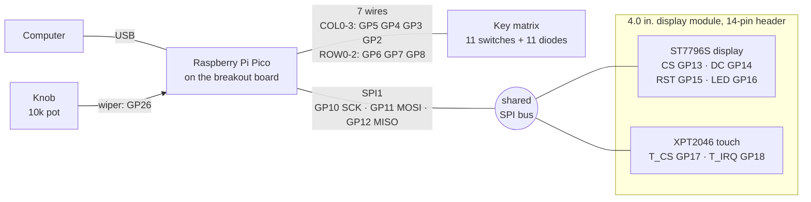
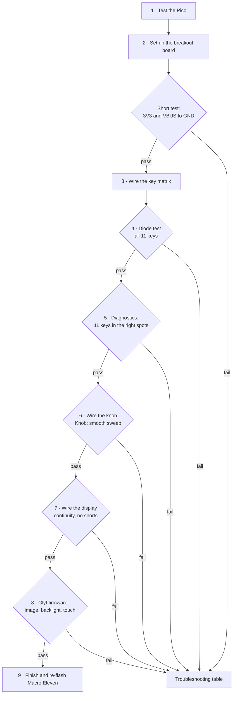
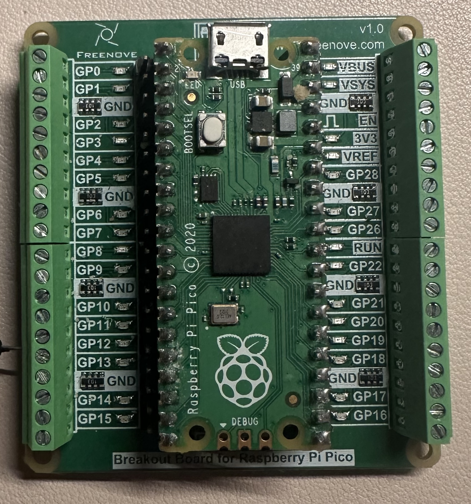
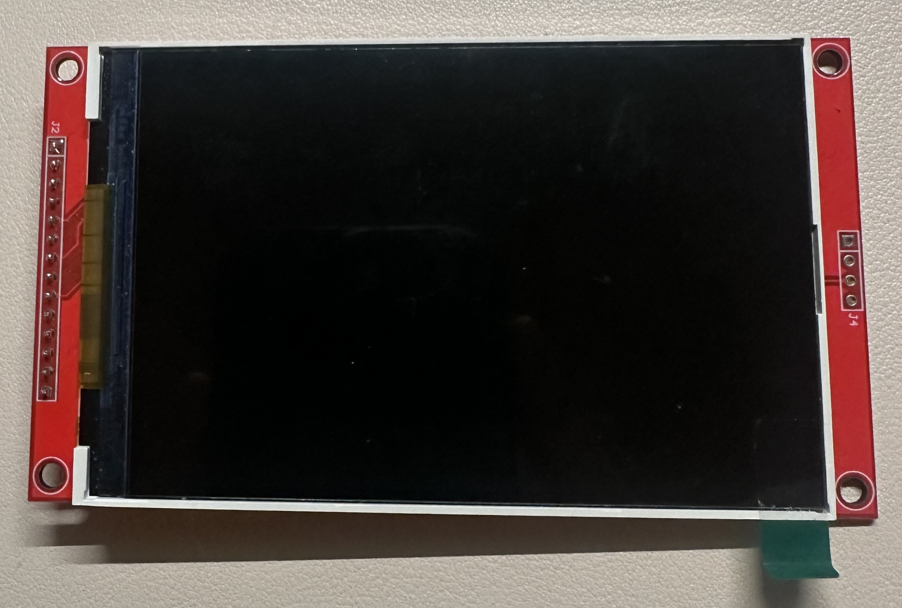
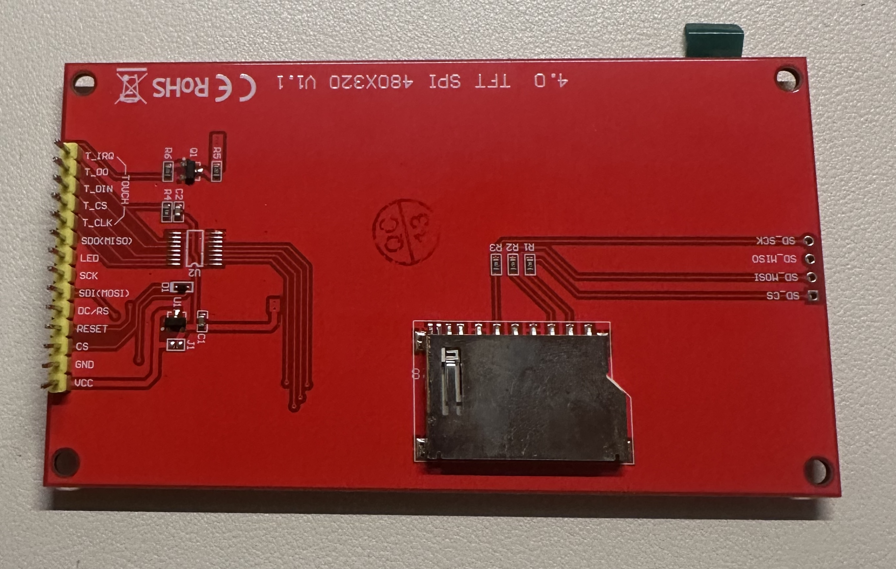

# Macro Eleven rev 2: hand-wiring guide

Step-by-step guide to hand-wire a Raspberry Pi Pico, the 11-key matrix, the knob, and the 4.0" touch display. The Pico sits on a screw-terminal breakout board. There is no custom PCB. Each stage ends with a test, so a fault shows up at the stage that caused it.

**This guide assumes this hardware:**

| Part | Detail |
|------|--------|
| MCU | Raspberry Pi Pico or Pico H (**RP2040**). A Pico 2 (RP2350) does not run this firmware. |
| Hub | Freenove Breakout Board for Raspberry Pi Pico: one screw terminal per Pico pin, each labeled with the pin name (photo in [Step 2](#step-2-set-up-the-breakout-board)) |
| Keys | 11 switches in the Macro Eleven layout (3 rows x 4 columns, knob in the top-right slot) |
| Knob | 10 kΩ linear potentiometer (B10K) |
| Display | 4.0" ST7796S SPI TFT, 480x320, XPT2046 resistive touch, 14-pin header (same panel as the [Glyf display module](../../../../glyf/display/docs/glyf.md), photos in [Step 7](#identify-the-display-header)) |

> **Firmware status.** No single rev 2 firmware exists yet (audit task SCR-09). This guide tests the board with the two firmwares that exist today:
> - **Macro Eleven (QMK)** tests the keys and the knob.
> - **Glyf display (Pico SDK)** tests the screen and touch.
>
> The pin plan below keeps the keys on the rev 1 pins and the display on the Glyf display pins. Both firmwares run on this board without changes.

> **Mermaid diagrams.** GitHub renders the `mermaid` blocks. In VS Code, install the *Markdown Preview Mermaid Support* extension. All wiring facts are also in the tables and text diagrams.

> **How this guide names connections.** Every wire goes to a breakout terminal, and the guide names it by the label printed next to that terminal: `GP5`, `3V3`, `GND`. The breakout prints no pin numbers, so this guide does not use them either (except in the [protoboard appendix](#appendix-permanent-protoboard-hub)). Display pins are numbered 1 to 14 from the top, with VCC as pin 1.

---

## Contents

1. [What you are building](#what-you-are-building)
2. [Pin plan](#pin-plan)
3. [Parts and tools](#parts-and-tools)
4. [Build order](#build-order)
5. [Step 1: Test the Pico](#step-1-test-the-pico)
6. [Step 2: Set up the breakout board](#step-2-set-up-the-breakout-board)
7. [Step 3: Wire the key matrix](#step-3-wire-the-key-matrix)
8. [Step 4: Test the matrix with a multimeter](#step-4-test-the-matrix-with-a-multimeter)
9. [Step 5: Connect the matrix and test the keys](#step-5-connect-the-matrix-and-test-the-keys)
10. [Step 6: Wire and test the knob](#step-6-wire-and-test-the-knob)
11. [Step 7: Wire the display](#step-7-wire-the-display)
12. [Step 8: Test the display and touch](#step-8-test-the-display-and-touch)
13. [Step 9: Finish](#step-9-finish)
14. [Troubleshooting](#troubleshooting)
15. [Firmware follow-ups](#firmware-follow-ups)
16. [Appendix: permanent protoboard hub](#appendix-permanent-protoboard-hub)

---

## What you are building



The display and the touch controller share one SPI bus (clock, data out, data in). Each one has its own chip-select line, so the Pico talks to one at a time.

---

## Pin plan

All signals are 3.3 V. **Never connect the `VBUS` or `VSYS` terminal (5 V) to anything in this build.**

| Function | Breakout terminal | Wire comes from |
|----------|-------------------|-----------------|
| COL0 (left column) | `GP5` | matrix lead `GP5` |
| COL1 | `GP4` | matrix lead `GP4` |
| COL2 | `GP3` | matrix lead `GP3` |
| COL3 (right column) | `GP2` | matrix lead `GP2` |
| ROW0 (top row) | `GP6` | matrix lead `GP6` |
| ROW1 | `GP7` | matrix lead `GP7` |
| ROW2 (bottom row) | `GP8` | matrix lead `GP8` |
| Knob wiper | `GP26` | knob leg 2 |
| Knob ground | `GND` between `GP28` and `GP27` (this one is AGND) | knob leg 1 |
| 3.3 V power | `3V3` | knob leg 3 and display pin 1 (VCC) |
| Display ground | `GND` below `VSYS` | display pin 2 (GND) |
| SPI clock | `GP10` | display pins 7 (SCK) and 10 (T_CLK) |
| SPI data out (MOSI) | `GP11` | display pins 6 (SDI) and 12 (T_DIN) |
| SPI data in (MISO) | `GP12` | display pin 13 (T_DO) |
| Display chip select | `GP13` | display pin 3 (CS) |
| Display data/command | `GP14` | display pin 5 (DC/RS) |
| Display reset | `GP15` | display pin 4 (RESET) |
| Backlight (PWM) | `GP16` | display pin 8 (LED) |
| Touch chip select | `GP17` | display pin 11 (T_CS) |
| Touch interrupt | `GP18` | display pin 14 (T_IRQ) |

### Breakout terminal map

Top view, USB at the top. The terminal names are exactly as printed on the breakout, in the same order. Double lines (`══`) mark the terminals this build uses. The text on the outside names the wire that goes in.

```
                        ┌─────┤ USB ├─────┐
                 GP0  ──┤                 ├── VBUS    (5 V: leave empty)
                 GP1  ──┤                 ├── VSYS    (5 V: leave empty)
                 GND  ──┤                 ╞══ GND  ── display GND
 COL3 (right) ── GP2  ══╡                 ├── EN      (not power: leave empty)
         COL2 ── GP3  ══╡                 ╞══ 3V3  ── display VCC + knob +
         COL1 ── GP4  ══╡                 ├── VREF
  COL0 (left) ── GP5  ══╡                 ├── GP28
                 GND  ──┤                 ╞══ GND  ── knob -  (AGND)
   ROW0 (top) ── GP6  ══╡                 ├── GP27
         ROW1 ── GP7  ══╡                 ╞══ GP26 ── knob wiper
ROW2 (bottom) ── GP8  ══╡   Pico on the   ├── RUN
                 GP9  ──┤   breakout      ├── GP22
                 GND  ──┤                 ├── GND
  SCK + T_CLK ── GP10 ══╡                 ├── GP21
  SDI + T_DIN ── GP11 ══╡                 ├── GP20
         T_DO ── GP12 ══╡                 ├── GP19
           CS ── GP13 ══╡                 ╞══ GP18 ── T_IRQ
                 GND  ──┤                 ├── GND
        DC/RS ── GP14 ══╡                 ╞══ GP17 ── T_CS
        RESET ── GP15 ══╡                 ╞══ GP16 ── LED (backlight)
                        └─────────────────┘
```

The layout groups well: the keys use the upper left terminals, the knob and power use the upper right terminals, and the display uses the lower terminals on both sides.

---

## Parts and tools

### Parts

- [ ] Raspberry Pi Pico or Pico H (RP2040)
- [ ] Freenove Breakout Board for Raspberry Pi Pico
- [ ] 11 mechanical switches (MX or Choc) in a plate, or hot-swap sockets (see [`shared/libs/hotswap-sockets`](../../../../../shared/libs/hotswap-sockets))
- [ ] 11 x 1N4148 diodes, plus spares
- [ ] 1 x 10 kΩ linear potentiometer (B10K) and a knob cap
- [ ] 1 x 4.0" ST7796S SPI TFT with XPT2046 touch (14-pin header)
- [ ] Solid-core wire, 22 to 26 AWG, in at least 4 colors
- [ ] 13 x female-to-male Dupont jumpers, 10 cm (display pins to terminals)
- [ ] Heat-shrink tube, masking tape for labels
- [ ] USB data cable (a charge-only cable does not work)

### Tools

- [ ] Small flat screwdriver for the terminals
- [ ] Soldering iron with a fine tip (330 to 350 °C for leaded solder, 350 to 380 °C for lead-free)
- [ ] Solder, 0.5 to 0.8 mm, and flux
- [ ] Multimeter with continuity (beep) and diode modes
- [ ] Flush cutters, wire strippers, tweezers
- [ ] Desoldering braid or pump
- [ ] Safety glasses and ventilation

### Suggested wire colors

| Color | Use |
|-------|-----|
| Red | 3V3 |
| Black | GND |
| Blue | Columns |
| Bare diode legs, or white | Rows |
| Yellow | SPI clock (GP10) |
| Green | MOSI (GP11) |
| Orange | MISO (GP12) |
| Gray | Chip selects, DC, reset |
| Purple | Backlight and touch IRQ |

### Safety

- Unplug USB before you solder or change any wire.
- Wear glasses when you clip leads. Cut leads fly.
- Work with ventilation. Wash your hands after you use leaded solder.

---

## Build order



Do not skip a test. A fault is easy to find when only one stage is new.

---

## Step 1: Test the Pico

1. Put the Pico on the breakout, with its USB port at the top edge, next to the `GP0` and `VBUS` labels. Nothing else is connected yet.
2. Hold the **BOOTSEL** button and plug the Pico into your computer. Release the button.
3. Confirm that a drive named `RPI-RP2` appears.
4. Copy the bundled Macro Eleven firmware to the drive:

   ```bash
   cp apps/macro-eleven/src-tauri/firmware/macro_eleven.uf2 /Volumes/RPI-RP2/
   ```

5. The drive disappears and the Pico restarts as Macro Eleven.
6. Run the companion app and confirm the status shows Connected:

   ```bash
   pnpm dev:macro-eleven
   ```

7. Open the **Diagnostics** page.

**Pass:** the app connects. No keys show as pressed.
**Fail:** no `RPI-RP2` drive. Try another USB cable (many cables are charge-only).
**Fail:** keys show as pressed with nothing connected. See [Troubleshooting](#troubleshooting), row "Keys show as pressed with nothing connected".

Unplug the Pico.

---

## Step 2: Set up the breakout board



The breakout is the hub. The keys, knob, and display each go straight into the screw terminals named in the [pin plan](#pin-plan). You can unscrew one part and test the others alone.

### Read the labels

- **`GND` appears eight times.** All eight are joined. Use the `GND` between `GP28` and `GP27` for the knob only: it is the Pico's AGND, the quiet ground for the ADC. Use the `GND` below `VSYS` for the display.
- **`3V3`** is the 3.3 V output. It feeds the knob and the display.
- **`EN`**, just above `3V3`, is not power. A wire from `EN` to `GND` switches off the 3.3 V supply. Leave it empty.
- **`VBUS` and `VSYS`** carry 5 V from USB. Leave them empty.
- **`VREF` and `RUN`** stay empty. (Optional: a push button from `RUN` to any `GND` resets the Pico. Hold BOOTSEL and tap it to enter the bootloader without unplugging the cable.)
- The small LED next to each label is an indicator on the breakout. It is not part of this build.

### Wire a terminal

1. Strip 5 mm of insulation, or use the male end of a Dupont jumper.
2. Open the clamp, put the wire in, and tighten the screw.
3. Pull the wire gently. It must not move.
4. When two wires share one terminal (`3V3`, `GP10`, `GP11`), twist them together before you tighten.
5. Check that no stray strand touches the terminal next to it.

### Test: no shorts

USB unplugged, multimeter in continuity mode. Repeat this test after each step that adds wires.

| Probe A | Probe B | Expected |
|---------|---------|----------|
| `3V3` | `GND` | No beep |
| `VBUS` | `GND` | No beep |

A short beep that stops at once is the Pico's capacitors charging. A steady beep means a short. Find it before you continue.

---

## Step 3: Wire the key matrix

The matrix uses 7 GPIO pins for 11 keys. Each key sits where one column wire meets one row wire. Each key has a diode, so the Pico can read several keys pressed at the same time without ghost presses.

### Matrix schematic

```
                        COL0 · GP5       COL1 · GP4       COL2 · GP3       COL3 · GP2
                        (left)                                             (right)
                        │                │                │                │
                        ├─[SW 0,0]─┐     ├─[SW 0,1]─┐     ├─[SW 0,2]─┐     │   no switch:
                        │          ▼     │          ▼     │          ▼     │   knob slot
  ROW0 · GP6 ───────────┼──────────┴─────┼──────────┴─────┼──────────┴─────┼───────────
                        │                │                │                │
                        ├─[SW 1,0]─┐     ├─[SW 1,1]─┐     ├─[SW 1,2]─┐     ├─[SW 1,3]─┐
                        │          ▼     │          ▼     │          ▼     │          ▼
  ROW1 · GP7 ───────────┼──────────┴─────┼──────────┴─────┼──────────┴─────┼──────────┴
                        │                │                │                │
                        ├─[SW 2,0]─┐     ├─[SW 2,1]─┐     ├─[SW 2,2]─┐     ├─[SW 2,3]─┐
                        │          ▼     │          ▼     │          ▼     │          ▼
  ROW2 · GP8 ───────────┼──────────┴─────┼──────────┴─────┼──────────┴─────┼──────────┴
```

- `▼` is a diode. The triangle points at the black band. **The band always faces the row.**
- At `┼`, a column crosses a row. **The two wires must not touch.**
- `[SW r,c]` is the switch at row `r`, column `c`. `[0,0]` is the top-left key (HOME in the `apps` keymap).

### Front and back view

You solder the switches from the back. From the back, the columns are mirrored.

```
  FRONT (keycap side)                  BACK (solder side, plate flipped)
  ┌──────┬──────┬──────┬──────┐        ┌──────┬──────┬──────┬──────┐
  │ 0,0  │ 0,1  │ 0,2  │ knob │        │ knob │ 0,2  │ 0,1  │ 0,0  │
  ├──────┼──────┼──────┼──────┤        ├──────┼──────┼──────┼──────┤
  │ 1,0  │ 1,1  │ 1,2  │ 1,3  │        │ 1,3  │ 1,2  │ 1,1  │ 1,0  │
  ├──────┼──────┼──────┼──────┤        ├──────┼──────┼──────┼──────┤
  │ 2,0  │ 2,1  │ 2,2  │ 2,3  │        │ 2,3  │ 2,2  │ 2,1  │ 2,0  │
  └──────┴──────┴──────┴──────┘        └──────┴──────┴──────┴──────┘
   COL0   COL1   COL2   COL3            COL3   COL2   COL1   COL0
   GP5    GP4    GP3    GP2             GP2    GP3    GP4    GP5
```

Put a strip of masking tape on the back of the plate. Write `GP5` above the rightmost column and `GP2` above the leftmost column.

### One key, close up

```
  COLUMN wire (insulated solid core;
  strip a short gap at each switch)
       │
       │         ┌─────────────┐
       ├─────────┤ pin 1       │
       │         │   switch    │  (seen from the back)
       │         │       pin 2 ├──┐
       │         └─────────────┘  │  anode leg
       │                          ▼  1N4148: triangle points at the band
       │                         ───  black band = cathode
       │                          │  cathode leg, bent along the row
 ROW ──┼──────────────────────────┴────────── on to the next key in this row
       │
       └── on to the next key in this column
```

### The diode

```
   anode leg                                  cathode leg
   to switch pin 2  ─────────[▒▒▒▒▒▒▒▒▒▒█]─────────  to ROW
                                        ▲
                                   black band (cathode)
```

### Procedure

1. Put the switches in the plate. Flip the plate so the pins face you.
2. Choose which switch pin is the **column pin** and which is the **diode pin**. Use the same choice on all 11 switches.
3. **Diodes.** For each switch:
   1. Bend the anode leg (the end without the band) into a small hook.
   2. Hook it around the diode pin and solder it. Keep the iron on the joint for 3 seconds or less. The glass body is sensitive to heat.
   3. Point the cathode leg (the band end) along the row, toward the next switch.
4. **Rows.** For each row, bend the cathode legs so each one overlaps the next. Solder each overlap. The legs now form a bare row wire.
   - Row 0 has only 3 switches. Nothing goes in the knob slot.
   - Keep each row wire at least 2 mm away from every column pin.
5. **Columns.** For each column, run one insulated wire past the column pin of each switch in that column.
   1. At each switch, strip a 3 mm gap in the insulation. Slide the insulation with the stripper to make the gap, without cutting the wire.
   2. Wrap the bare gap once around the column pin and solder it.
   3. The column wire crosses the bare row wires. The insulation keeps them apart. Check each crossing.
6. **Leads.** Solder one wire to the end of each column (4 wires) and each row (3 wires). Make each lead long enough to reach its terminal. Label each lead with a tape flag that shows its terminal name:

   | Lead | Tape label |
   |------|------------|
   | COL0 (left, seen from the front) | `GP5` |
   | COL1 | `GP4` |
   | COL2 | `GP3` |
   | COL3 (right, seen from the front) | `GP2` |
   | ROW0 (top) | `GP6` |
   | ROW1 | `GP7` |
   | ROW2 (bottom) | `GP8` |

   Use the back view above to find the columns. From the back, `GP5` is the rightmost column.
7. Clip all extra leads. Inspect each joint: it must be shiny and cone-shaped, and must not touch the joint next to it.

> **Hot-swap sockets:** the wiring is the same. Solder to the two socket pads instead of the switch pins.

---

## Step 4: Test the matrix with a multimeter

Test the matrix at the ends of its 7 leads, before you connect them to the breakout.

Set the multimeter to **diode mode**. Put the **red** probe on the column lead and the **black** probe on the row lead of the key under test.

| Condition | Expected reading |
|-----------|------------------|
| Key released | `OL` (open) |
| Key pressed | 0.5 to 0.7 V (500 to 700 mV) |
| Probes swapped, key pressed | `OL` (this proves the diode points the right way) |

Then check for shorts, with no keys pressed, in continuity mode:

| Probe A | Probe B | Expected |
|---------|---------|----------|
| Any column lead | Any other column lead | No beep |
| Any row lead | Any other row lead | No beep |
| Any column lead | Any row lead | No beep |

Tick each key as it passes:

| | COL0 · `GP5` | COL1 · `GP4` | COL2 · `GP3` | COL3 · `GP2` |
|---|:---:|:---:|:---:|:---:|
| **ROW0 · `GP6`** | [ ] | [ ] | [ ] | knob |
| **ROW1 · `GP7`** | [ ] | [ ] | [ ] | [ ] |
| **ROW2 · `GP8`** | [ ] | [ ] | [ ] | [ ] |

---

## Step 5: Connect the matrix and test the keys

1. USB unplugged. Screw each lead into the terminal named on its tape flag: `GP5`, `GP4`, `GP3`, `GP2`, `GP6`, `GP7`, `GP8`.
   - On the breakout, the column terminals run in reverse order from the top: `GP2` (COL3), `GP3`, `GP4`, `GP5` (COL0). Match the labels, not the order.
2. Plug in USB. The Pico still runs the Macro Eleven firmware from Step 1.
3. Run `pnpm dev:macro-eleven` and open the **Diagnostics** page.
4. Press each key, one at a time. Then press two keys at the same time.

**Pass:** each key lights its own cell, in the same position as on the pad. Two keys pressed together light only those two cells.

> The keys do not type text by themselves with this firmware. The firmware starts in host-control mode and only reports key states to the app. This is expected.

| Symptom | Cause | Fix |
|---------|-------|-----|
| Cells are mirrored left to right | Columns reversed | Swap the `GP5` and `GP2` leads, and the `GP4` and `GP3` leads |
| Cells are mirrored top to bottom | Rows reversed | Swap the `GP6` and `GP8` leads |
| One key does nothing | Bad joint or reversed diode | Repeat the Step 4 diode test on that key |
| A full row or column does nothing | Broken wire, loose terminal, or wrong terminal | Tighten the terminal. Check continuity from the lead to the terminal screw. |

---

## Step 6: Wire and test the knob

```
        shaft faces you, legs point down
              ┌───────────┐
              │   ( o )   │   10k linear pot (B10K)
              └──┬──┬──┬──┘
                 1  2  3
                 │  │  └────── 3V3
                 │  └───────── GP26  (wiper)
                 └──────────── GND between GP28 and GP27  (AGND)
```

1. Unplug USB.
2. Solder three wires to the pot legs. Put heat-shrink on each leg.
3. Screw them into the terminals:
   - Leg 1 to the `GND` between `GP28` and `GP27`.
   - Leg 2 to `GP26`.
   - Leg 3 to `3V3`. Leave room in this terminal: the display power wire joins it in Step 7.
4. Plug in USB. In the app, open the **Knob** page.
5. Turn the knob from one end to the other.

**Pass:** the value moves smoothly from about 0 to about 1023. Clockwise increases the value.

- If clockwise decreases the value, swap the wires on legs 1 and 3.
- If the value jumps or is noisy, shorten the wires and confirm leg 1 goes to the `GND` between `GP28` and `GP27`. Optional: add a 100 nF capacitor between the `GP26` terminal and that `GND` terminal.

---

## Step 7: Wire the display

### Identify the display header

Hold the module with the screen facing you and the 14-pin header on the left edge. **Pin 1 (VCC) is at the top.** Every diagram in this guide shows the header this way: VCC at the top, T_IRQ (pin 14) at the bottom.





- The pin labels are only on the back, and you cannot see them from the front. Wire from the diagram below, not from the back photo. The photo shows the pin order upside down.
- The square pad on the front marks pin 1 (VCC). Find it before you connect any wire.
- To read the labels without losing your place, flip the module left to right, like a page in a book. VCC stays at the top and the header moves to the right edge. The labels read upside down, but the pin order matches the diagram.
- The module's silkscreen names the 14-pin header `J2`. This guide calls it the display header.
- Leave the 4-pin SD card header (`J4` on the module: SD_CS, SD_MOSI, SD_MISO, SD_SCK) unconnected. This build does not use the SD card.

### Display header wiring

VCC (pin 1) is at the top, the same as the front photo. The left column is the breakout terminal for each pin.

```
  terminal           display header, VCC at the top
                     ┌────┬─────────┐
  3V3  ──────────────┤  1 │ VCC     │  square pad
  GND  ──────────────┤  2 │ GND     │
  GP13 ──────────────┤  3 │ CS      │
  GP15 ──────────────┤  4 │ RESET   │
  GP14 ──────────────┤  5 │ DC/RS   │
  GP11 ──────────────┤  6 │ SDI     ├────────┐
  GP10 ──────────────┤  7 │ SCK     ├────┐   │
  GP16 ──────────────┤  8 │ LED     │    │   │
  leave open     X   │  9 │ SDO     │    │   │
                     │ 10 │ T_CLK   ├────┘   │  also to GP10, with pin 7
  GP17 ──────────────┤ 11 │ T_CS    │        │
                     │ 12 │ T_DIN   ├────────┘  also to GP11, with pin 6
  GP12 ──────────────┤ 13 │ T_DO    │
  GP18 ──────────────┤ 14 │ T_IRQ   │
                     └────┴─────────┘
```

- `3V3` also holds the knob's leg 3 wire from Step 6.
- Use the `GND` below `VSYS` for display pin 2. Keep the `GND` between `GP28` and `GP27` for the knob.

### The shared SPI bus

The display and the touch controller use the same clock and data lines. Two display pins go to each shared terminal:

| Terminal | Display pins |
|----------|--------------|
| `GP10` | 7 (SCK) and 10 (T_CLK) |
| `GP11` | 6 (SDI) and 12 (T_DIN) |

> **Why pin 9 (SDO) stays open.** The firmware only writes to the display. It never reads from it. Some panels do not release the shared MISO line when their chip select is off, and that corrupts touch readings. With pin 9 open, only the touch controller drives GP12. The Glyf display README connects pin 9. This guide leaves it open on purpose.

### Procedure

1. Unplug USB.
2. Lay the display next to the breakout, screen up, VCC at the top.
3. Work down the header from pin 1. For each pin in the diagram, push the female end of a jumper onto the display pin and screw the male end into its terminal. Skip pin 9. You use 13 jumpers.
4. Make the two shared terminals together: pins 7 and 10 into `GP10`, then pins 6 and 12 into `GP11`.
5. Keep every display jumper at **10 cm or shorter**. The display SPI bus runs at 40 MHz, and long wires corrupt the signal.

### Test: continuity

USB unplugged:

| Check | Expected |
|-------|----------|
| Each wired display pin to its terminal screw | Beep |
| Display pin 7 to pin 10 | Beep (both on `GP10`) |
| Display pin 6 to pin 12 | Beep (both on `GP11`) |
| Display pin 9 to any other pin | No beep |
| `3V3` to `GND` | No beep |

---

## Step 8: Test the display and touch

### Power-on smoke test

1. Plug in USB. The Pico still runs the Macro Eleven firmware.
2. The Macro Eleven firmware does not use the display pins. The screen can stay dark or show plain white. Both are normal.
3. Touch the Pico and the display module lightly for 10 seconds. **If anything gets hot, unplug at once** and check for a short between `3V3` and `GND`.

### Flash the Glyf display firmware

This firmware uses the same display terminals (`GP10` to `GP18`). It needs the Pico SDK (see [sdks/README.md](../../../../../sdks/README.md)).

```bash
export PICO_SDK_PATH=/path/to/pico-sdk
pnpm firmware:build
# Hold BOOTSEL and plug in USB, then:
pnpm firmware:flash:uf2
pnpm dev:glyf
```

### What you should see

| Check | Pass |
|-------|------|
| Power-on | The screen flashes white, then goes black |
| Glyf app: **Display** page, fill color | The whole screen changes to the color |
| Glyf app: **Display** page, brightness | The backlight dims and brightens |
| Glyf app: **Touch Monitor** page | A point follows your fingernail or a stylus (this is a resistive touch screen: press, do not just tap) |

> **Known firmware issues (not wiring faults).** The image can be mirrored or rotated (audit task GFW-01, wrong MADCTL). Touch positions can be offset or inverted because touch calibration does not exist yet (SCR-10). If the colors fill the whole screen and touch points move when you move, the wiring is correct.

---

## Step 9: Finish

1. Flash the Macro Eleven firmware again. Hold BOOTSEL, plug in USB, then:

   ```bash
   cp apps/macro-eleven/src-tauri/firmware/macro_eleven.uf2 /Volumes/RPI-RP2/
   ```

2. Repeat the Diagnostics and Knob checks from Steps 5 and 6.
3. Tighten every terminal screw again. Pull each wire gently.
4. Take photos of the breakout and the back of the switch plate. They help later debugging.

### Final checklist

- [ ] Every terminal screw is tight, and no stray strand touches the next terminal
- [ ] `3V3` and `VBUS` do not beep to `GND`
- [ ] `EN`, `VBUS`, and `VSYS` are empty
- [ ] All 11 diode bands face the row wire
- [ ] Column wires do not touch row wires at any crossing
- [ ] Display pin 9 (SDO) is not connected
- [ ] Display jumpers are 10 cm or shorter
- [ ] All 11 keys pass in the Diagnostics, in the right positions
- [ ] The knob sweeps from about 0 to about 1023
- [ ] The display fills with color and touch responds (Glyf firmware)
- [ ] The Macro Eleven firmware is back on the Pico

---

## Troubleshooting

| Symptom | Likely cause | Check or fix |
|---------|--------------|--------------|
| No `RPI-RP2` drive | Charge-only USB cable, or a short on 3V3 | Try another cable. Check `3V3` to `GND` for a steady beep. |
| Pico does not start, or 3V3 is dead | A wire in `EN` | Empty the `EN` terminal. It is next to `3V3`. |
| Pico disconnects when you plug in the display | Short or too much load on 3V3 | Unplug. Check display pins 1 and 2 for a short. |
| Keys show as pressed with nothing connected | The breakout's indicator LED on each terminal can pull a pin low against the Pico's weak internal pull-up | Test the Pico alone, off the breakout. If the fault goes away, the breakout causes it. |
| One key does nothing | Cold joint, or reversed diode | Diode test on that key (Step 4). Reflow its joints. |
| Two keys fire from one press | Column touches row, or a diode is shorted | Check the crossings near those keys. Replace the diode. |
| Keys mirrored in the Diagnostics | Columns wired from the back view | Swap the `GP5` and `GP2` leads, and the `GP4` and `GP3` leads. |
| Knob reads backwards | Outer legs swapped | Swap the wires on pot legs 1 and 3. |
| Knob value is noisy | Long wires, or knob ground on the wrong `GND` | Use the `GND` between `GP28` and `GP27`. Shorten the wires. Add 100 nF from `GP26` to that `GND`. |
| Screen stays white with Glyf firmware | CS, DC, RESET, SCK, or MOSI wiring | Continuity from display pins 3, 4, 5, 6, 7 to `GP13`, `GP15`, `GP14`, `GP11`, `GP10`. |
| Screen stays black, no backlight | LED or VCC wiring | Continuity from display pin 8 to `GP16`, and from pin 1 to `3V3`. |
| Random pixels or noisy image | Display wires too long | Shorten them to 10 cm or less. As a test, lower `TFT_SPI_BAUD` in [`pinout.h`](../../../../glyf/display/firmware/src/pinout.h) to `20000000u`. |
| Image mirrored or rotated | Firmware (GFW-01), not wiring | No wiring change needed. |
| Touch does not respond | T_CS, T_IRQ, or T_DO wiring | Continuity from display pins 11, 14, 13 to `GP17`, `GP18`, `GP12`. Confirm pin 9 is open. |
| Touch works but positions are wrong | No touch calibration yet (SCR-10) | No wiring change needed. |

---

## Firmware follow-ups

This build answers two open decisions in the [codebase audit](../../../../../docs/audit/2026-09-24-action-plan.md):

1. **Rev 2 pin plan (open decision 7).** Use the [pin plan](#pin-plan) above in `firmware/rev2/keyboard.json` (SCR-09). The display pins match the Glyf display module, so both products can use the same panel driver pin setup.
2. **Top-left key (open decision 3, FW-08).** This guide wires `[0,0]` as the physical top-left key and `[0,3]` as the knob slot. `config.h` sets bootmagic to `[0,2]`. Change it to `BOOTMAGIC_ROW 0` and `BOOTMAGIC_COLUMN 0` so the top-left key enters the bootloader.

If this build confirms that leaving display pin 9 open is correct, update the pin table in the root [README.md](../../../../../README.md) and in [glyf.md](../../../../glyf/display/docs/glyf.md) to match.

---

## Appendix: permanent protoboard hub

Use this section only to move the prototype from the breakout to a soldered protoboard. The keys, knob, and display wiring stay the same. Each breakout terminal becomes a Pico header pin, and the three connectors J1, J2, and J3 replace the screw terminals.

### Extra parts

- [ ] 1 x protoboard, about 7 x 9 cm or larger
- [ ] 2 x 1x20 female headers (socket for the Pico), and 2 x 1x20 male headers if your Pico has none
- [ ] Header strips for the connectors: J1 (1x7), J2 (1x14), J3 (1x3)
- [ ] 30 AWG wire-wrap wire, Kapton tape

### Pico pinout (top view, USB at the top)

The breakout labels match this order. Pin numbers are the Pico's.

```
                            ┌─────┤ USB ├─────┐
                 GP0   1 ───┤                 ├─── 40 VBUS
                 GP1   2 ───┤                 ├─── 39 VSYS
                 GND   3 ───┤                 ╞═══ 38 GND      ── display GND
 COL3 (right) ── GP2   4 ═══╡                 ├─── 37 3V3_EN   (breakout: EN)
         COL2 ── GP3   5 ═══╡                 ╞═══ 36 3V3(OUT) ── display VCC + knob +
         COL1 ── GP4   6 ═══╡                 ├─── 35 ADC_VREF (breakout: VREF)
  COL0 (left) ── GP5   7 ═══╡                 ├─── 34 GP28
                 GND   8 ───┤                 ╞═══ 33 AGND     ── knob -  (breakout: GND)
   ROW0 (top) ── GP6   9 ═══╡                 ├─── 32 GP27
         ROW1 ── GP7  10 ═══╡     RP2040      ╞═══ 31 GP26     ── knob wiper
ROW2 (bottom) ── GP8  11 ═══╡                 ├─── 30 RUN
                 GP9  12 ───┤                 ├─── 29 GP22
                 GND  13 ───┤                 ├─── 28 GND
  SCK + T_CLK ── GP10 14 ═══╡                 ├─── 27 GP21
  SDI + T_DIN ── GP11 15 ═══╡                 ├─── 26 GP20
         T_DO ── GP12 16 ═══╡                 ├─── 25 GP19
           CS ── GP13 17 ═══╡                 ╞═══ 24 GP18     ── T_IRQ
                 GND  18 ───┤                 ├─── 23 GND
        DC/RS ── GP14 19 ═══╡                 ╞═══ 22 GP17     ── T_CS
        RESET ── GP15 20 ═══╡                 ╞═══ 21 GP16     ── LED (backlight)
                            └───┬────┬────┬───┘
                              SWCLK GND SWDIO     (SWD pads)
```

### Warning: the underside is mirrored

You solder on the underside of the protoboard. From below, the Pico is mirrored left to right. **Pin 1 (GP0) is at the top right.**

```
               ┌─────┤ USB ├─────┐
    VBUS 40 ───┤                 ├─── 1  GP0
    VSYS 39 ───┤                 ├─── 2  GP1
     GND 38 ───┤                 ├─── 3  GND
         ...   │  solder side    │   ...
    GP17 22 ───┤                 ├─── 19 GP14
    GP16 21 ───┤                 ├─── 20 GP15
               └─────────────────┘
```

Before each solder joint on the Pico header, count pins from the nearest GND pin (3, 8, 13, 18 on one side; 23, 28, 33, 38 on the other). GND pins have square pads on the Pico, so they are easy to find.

### Layout

```
                    board edge: USB cable exits here
┌─────────────────────────┬─────────────┬───────────────────────────┐
│                         │     USB     │                           │
│  J1 matrix (1x7)        │             │   J3 knob (1x3)           │
│  ┌──┬──┬──┬──┬──┬──┬──┐ │             │   ┌──┬──┬──┐              │
│  │C0│C1│C2│C3│R0│R1│R2│ │    Pico     │   │ -│ W│ +│              │
│  └──┴──┴──┴──┴──┴──┴──┘ │  in female  │   └──┴──┴──┘              │
│   wires to pins 4-11 ───┤   headers   ├─── wires to pins 31-36    │
│                         │             │                           │
│                         │             │     J2 display (1x14)     │
│                         │             │     ┌────┬─────────┐      │
│                         │             │     │  1 │ VCC     │      │
│                         │             │     │  2 │ GND     │      │
│                         │             │     │  3 │ CS      │      │
│                         │             │     │  4 │ RESET   │      │
│                         │             │     │  5 │ DC/RS   │      │
│                         │             │     │  6 │ SDI     │      │
│                         └─────────────┘     │  7 │ SCK     │      │
│                                             │  8 │ LED     │      │
│   wires from pins 14-24 (both sides         │  9 │ SDO     │      │
│   of the Pico) run on the underside         │ 10 │ T_CLK   │      │
│   to J2                                     │ 11 │ T_CS    │      │
│                                             │ 12 │ T_DIN   │      │
│                                             │ 13 │ T_DO    │      │
│                                             │ 14 │ T_IRQ   │      │
│                                             └────┴─────────┘      │
└───────────────────────────────────────────────────────────────────┘
```

J2 stands as a vertical column with pin 1 (VCC) at the top, the same way you hold the display. The display lies to the right of the board, so each display pin sits level with its J2 pin.

### Connector pinouts

**J1: key matrix (1x7)**

| J1 pin | Lead | Pico pin |
|-------:|------|---------:|
| 1 | `GP5` (COL0) | 7 |
| 2 | `GP4` (COL1) | 6 |
| 3 | `GP3` (COL2) | 5 |
| 4 | `GP2` (COL3) | 4 |
| 5 | `GP6` (ROW0) | 9 |
| 6 | `GP7` (ROW1) | 10 |
| 7 | `GP8` (ROW2) | 11 |

**J3: knob (1x3)**

| J3 pin | Knob leg | Signal | Pico pin |
|-------:|---------:|--------|---------:|
| 1 (-) | 1 | AGND | 33 |
| 2 (W) | 2 | GP26 (wiper) | 31 |
| 3 (+) | 3 | 3V3(OUT) | 36 |

**J2: display (1x14)**, vertical, pin 1 (VCC) at the top. J2 pin *n* goes to display pin *n*. Each J2 pin wires to the Pico pin of its breakout terminal in the [display header wiring](#display-header-wiring): `3V3` is pin 36, `GND` is pin 38, and each `GPn` is its pin in the pinout above. On the underside, join J2 pin 7 to pin 10 and pin 6 to pin 12 with short bridges, then run one wire from each bridge to the Pico. Pin 9 stays unconnected.

### Procedure

1. Plug the Pico's male headers into the two female headers. Set the whole stack on the protoboard, with the USB port at the board edge.
2. Solder two opposite corner pins of each female header. Check that the Pico sits flat. Then solder the other pins. The Pico keeps the headers aligned while you solder.
3. Remove the Pico. From now on, it stays out while you solder. It goes back in only for tests.
4. Solder J1, J2, and J3 in the places shown in the layout. Solder J2 as a vertical column with pin 1 at the top. Leave at least one empty row of holes between a connector and the Pico headers.
5. Run the wires on the underside, from each Pico header pin to its connector pin (tables above). Use the [mirrored view](#warning-the-underside-is-mirrored).
   - From the underside, J2 is on the left of the Pico. Its pin 1 is still at the top: the mirror swaps left and right, not top and bottom.
6. Keep the SWD pads at the bottom edge of the Pico clear, so you can connect a debug probe later.
7. Plug the matrix leads into J1, the knob into J3, and the display into J2 (female-to-female jumpers, 10 cm or shorter, pin *n* to J2-*n*).
8. Put Kapton tape on the underside of the protoboard if it can touch metal.

### Test: no shorts

Pico **out** of the socket, multimeter in continuity mode:

| Probe A | Probe B | Expected |
|---------|---------|----------|
| Pin 36 (3V3) | Pin 38 (GND) | No beep |
| Pin 40 (VBUS) | Pin 38 (GND) | No beep |
| Each connector pin | The pin next to it (except the J2 bridges) | No beep |
| Each connector pin | Its Pico header pin | Beep |

Then repeat the tests from Steps 5, 6, and 8.
